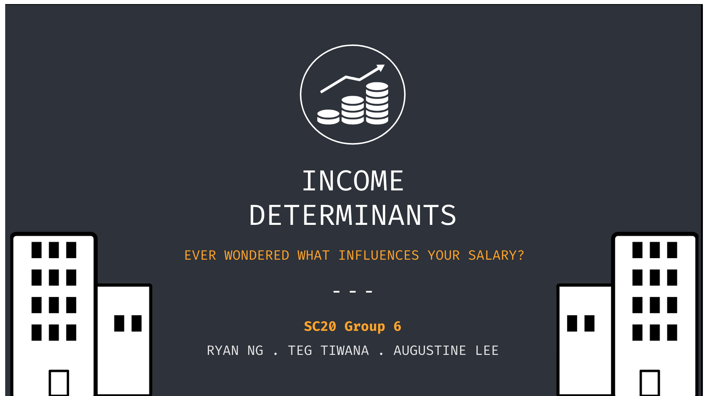

# SC1015 Project - Income Determinants #

Welcome to our project's repository for SC1015: Introduction to Data Science and Artificial Intelligence !

## Problem Formulation ##  
In this project, we are interested in finding out how different factors affect one's income. We felt that this will serve useful for people who wish to enter a new job and would like to know, with their characteristics, what is the rough income they can expect to receive. We aim to create a classification model that will take in the features of an individual and predict an income class. Hence, the questions we aim to answer through our project are:
- What are the most important factors in determining one's income?
- Can we create a ML model to classify one's potential income to an income range based on his/her information?

**Performance Metric:** F1 (Macro-averaging) score. F1 score takes into account both precision and recall, and macro averaging treats each income class as equal.

## Repository Organisation ##
- Data folder: Contains the raw dataset, reduced dataset and train and test datasets. It also contains the data dictionary and occupation code files obtained from the US Census Department.
- Supplementary Information folder: Contains Data Dictionary and Occupation Codes
- Data Cleaning.ipynb: Notebook for Data Cleaning and Preprocessing
- Feature Engineering.ipynb: Notebook for Feature Transformation and Dimension Reduction
- EDA.ipynb: Notebook for Exploratory Data Analysis
- ML_Decision Tree Classifier.ipynb: Notebook for Decision Tree Classifier model
- ML_Gradient Boosting Classier.ipynb: Notebook for Gradient Boosting Classifier (XGBoost) model
- ML_Support Vector Machines.ipynb: Notebook for SVM model
- ML_Logistic Regression.ipynb: Notebook for Logistic Regression model
- ML_K-Nearest-Neighbours.ipynb: Notebook for KNN model

**Flow of Project:**
1. Data Cleaning.ipynb
2. EDA.ipynb
3. Feature Engineering.ipynb
4. Machine Learning Notebooks

## Data Source ##  
To address our problem, we have used the the Annual Social and Economic Supplements from the United States' Census Bureau Current Population Survey 2021. This dataset provides us with data of American and a wide range of their information, from innate characteristics (race, gender etc) to education attaintment to familial information, as well as their corresponding income.
- Source: https://www.census.gov/data/datasets/time-series/demo/cps/cps-asec.html

## Data Cleaning and Preprocessing ##
Our raw dataset has 830 columns and 163543 rows. Through the data dictionary, we found that the columns were classified into 10 broad areas:
1. Record Identifiers
2. Weights
3. Demographics
4. Basic CPS Items
5. Work Experience
6. Income
7. Poverty
8. Health Insurance
9. Supplemental Poverty Measure
10. Migration

From there, we conducted the following steps to preprocess our data:
- Preliminary selecting relevant columns based on assumption
- Check for missing and invalid entries
- As our problem is a classification problem, we encode our response variable (Salary) into 4 classes.
- Splitting into train and test data (80:20)

In our preprocessing, we made the following assumption (justification found in notebook):
- Only features in the areas of Demographics, Basic CPS Items, Work Experience and Income are relevant to our problem.

#
## Exploratory Data Analysis ##
For Exploratory Data Analysis, we did the following steps:
1. Understand dataset dimension
2. Exploration of features through Single-Variate Analysis
3. Understanding relationship of each feature with Salary through Bi-Variate Analysis
4. Exploring possible trends through Multi-Variate Analysis

The combined summary of the our insights from Single-Variate, Bi-Variate and Multi-Variate Analysis can be found at the end of the notebook.

#
## Feature Engineering ##
In this notebook, we did feature scaling (numerical) using MinMax Scaler and dimension reduction through feature selection (categorical) using Mutual Information (MI) and Chi-Squared Test for Independence (Chi-2). MI and Chi-2 measures the dependence between categorical features and salary. The categorical features with the most significant dependence with Salary are: Occupation, Education, Less than 35hrs for at least 1 week, Occupation Group, Longest Industry, More than 35hrs weekly, Industry, Detailed Household Status, Marital. However, the P Scores of all features are below 0.05, suggesting that all features have significant dependence with our response variable. Hence, reducing the dimension may not help with model's performance.

#
## ML - Support Vector Machines ##
In this notebook, we explored the use of Support Vector Machines
- Initial tests ran across the various kernels, yielding the following scores: 0.17488 (rbf kernel), 0.259292 (polynomial kernel), 0.280103 (sigmoid kernel)
- Was unable to arrive at any result when testing on linear kernel (runtime was in excess of 16 hours for the first iteration under default parameters)
- Attempt at hyperparameter tuning was unsuccessful due to extremely poor time efficiency of the model across the kernels, with the rbf kernel notably taking ~50 minutes per iteration
- Observed that feature engineering did help the performance of the rbf kernel somewhat significantly, but was otherwise ineffective against the other kernels

#
## ML - Logistic Regression ##
In this notebook, we explored the use of Logistic Regression
- Initial tests ran across the various solvers, yielding the following scores: 0.511295 (lbfgs solver), 0.498697 (sag solver), 0.490747 (saga solver), 0.502402 (liblinear solver)
- Through hyperparameter tuning (solver, penalty, C) with RandomizedSearchCV and a subsequent for loop, we found the optimal solver to be liblinear, penalty to be l1 and C to be 3, and this model yielded a F1-score of 0.512655
- Observed that feature engineering did not help in improving performance of the model

#
## ML - K-Nearest-Neighbors ##
In this notebook, we explored the use of K-nearest Neighbors
- Our base model with default parameters yielded a F1-score of 0.497063
- Through hyperparameter (n_neighbors) tuning, we found the optimal n_neighbor value to be 48, and this model yielded a F1-score of 0.512647

#
## ML - Decision Tree Classifier ##
In this notebook, we explored the use of a Decision Tree Classifier.
- Our base model of max depth 3 yielded a f1 score of 0.47628.
- Through hyperparameter (max depth) tuning, we found the optimal max depth is about 7-13.
- We conducted cross-validation using GridSearchCV and found the optimal max depth is 11 and this model yielded a f1 score of 0.53561.
- Industry, Disability, Age and Occupation Group are the top factors considered by our decision tree classifier.

#
## ML - AdaBoost Classifier ##
In this notebook, we implemented different Adaptive Boosting Classifier Models.
- Our base model with 300 n_estimators, the SAMME.R alogorithm and learning rate of 1.0, yielded a f1 score of 0.56464.
- Through hyperparameter tuning using cross-validation on RandomSearchCV, we found the following optimal parameters of 'n_estimators': 1000 and 'learning_rate': 0.8676530612244899 and the model yielded a f1 score of 0.56669.
- After we tuned our model, we found the most relevant features to our model and thus the most consequential features affecting a person’s salary: the industry they are working in (most significant), the occupation they are working in, the person’s age. Some features were a little less relevant to determine one’s salary: whether you are an army veteran(least significant) and whether you have a government-issued Professional Certificate
- After tuning, both the training and test set accuracy do not have much of a difference in f1-scores as compared to other ML models, and thus this means that there was alomost no overfitting of data in this model.

#
## ML - Gradient Boosting Classifier (SKLearn) ##
In this notebook, we implemented different Gradient Boosting Machine Classifier Models.
- Our base model with 300 n_estimators, the subspace of 0.7 and max_depth of 3, yielded a f1 score of 0.57255.
- Through hyperparameter tuning using cross-validation on RandomSearchCV, we found the following optimal parameters of 'subsample': 0.65, 'n_estimators': 450, 'max_depth': 6 and 'learning_rate': 0.02583333333 and the model yielded a f1 score of 0.57836.
- After we tuned our model, we found the most relevant features to our model and thus the most consequential features affecting a person’s salary: the occupation they are working in (most significant), whether you work less than 35 hours a week or not, their highest attained education status and lastly how long they have worked in a week. Some features were a little less relevant to determine one’s salary: Whether you work more than 35 hours a week or not (least significant), whether you have a government-issued Professional Certificate, whether you are disabled and whether you are an army veteran.
- After tuning, both the training and test set accuracy have a significant deviation, a much larger difference in f1-scores (almost a 0.1 f1-score difference between the test and train data) than other ML models, and thus this could mean that there is overfitting of data in this model, and thus might not be the best model to use.

#
## ML - CatBoost Classifier ##
In this notebook, we trained different CatBoost Classifier models
- Our base model with 300 iterations, depth 3 and learning rate of 0.1, yielded a f1 score of 0.57006.
- Through hyperparameter tuning using cross-validation on RandomSearchCV, we found the following optimal parameters of 'learning_rate': 0.1149999, 'iterations': 1000 and 'depth': 4 and the model yielded a f1 score of 0.57596.
- After we tuned our model, we found the most relevant features to our model and thus the most consequential features affecting a person’s salary: the industry they are working in (most significant), the level of education they have attained, their citizen status and lastly the person’s age. Some features were a little less relevant to determine one’s salary: Whether you work less than 35 hours a week (least significant), whether you have a government-issued Professional Certificate and whether you are an army veteran
- After tuning, both the training and test set accuracy are still quite comparable and this is one of the key benefits of using the CatBoost model as it is specially designed to prevent overfitting of data. Thus there was very little overfitting in the model.

#
## ML - XGBoost Classifier ##
In this notebook, we trained XGBoost Classifier models.
- Our base model of max depth 3, n_estimators 300 and subsample 0.7 yield a f1 score of 0.57372.
- Through hyperparameters (max depth, n_estimators and subsample) tuning, we estimated the optimal max depth to be 7-12.
- After cross-validation, we found the optimal hyperparameters to be max depth=3, n_estimators=150 and subsample=0.8. This model yield a f1 score of 0.57462.
- After using our feature engineered data, the model performance improved and the f1 score rose to 0.57609.

#
## Conclusions and Recommendations ##
- The most important factors, identified by our best performing model (XGBoost) affecting one's salary are:
  1. Marital Status
  2. Age
  3. Whether you work more than 35 hours a week
  4. Possession of government-issued Professional Certificate
  5. Gender
 
- From our second best performing model (CatBoost), we can also note the most important factors affecting one's salary are:
  1.  Industry they are working in
  2.  Level of education they have attained
  3.  Citizen Status

- Our tuning and selection of ML models have increased the f1 score from an initial 0.39 to 0.57. In the confusion matrix, we see that the diagonals are well lit-up too. However, adjacent squares have quite a high incidence too.
- We believe that it is because Salary can be affected by non-quantifiable data like one's connections, EQ, negotiation skills, individual interview performance, company's budget availability and payment methods (stock options, housing, education - not just Salary).

#
## New tools we have learnt ##
- Data Visualisation: GraphViz
- Feature Engineering: MinMax Scaler, Mutual Information, Chi-Squared Test
- Cross-Validation: GridSearchCV, RandomSearchCV
- ML models: XGBoost Classifier, Support Vector Machine, K-Nearest-Neighbours, Logistic Regression, Adaptive Boosting, Gradient Boosting Classifier (SKLearn) and CatBoost.

#
## Contributors ##
- Ryan Ng (@iamshlomo) : Support Vector Machine, K-Nearest-Neighbours, Logistic Regression, Presentation
- Teg Singh Tiwana (@tej172) : CatBoost Classifer, Gradient Boosting Classifier, Adaptive Boosting, Presentation
- Augustine Lee (@auglxw) : Data Cleaning, Exploratory Data Analysis, Feature Engineering, Decision Tree Classifier, XGBoost Classifier

#
## References ##
- https://machinelearningmastery.com/feature-selection-with-categorical-data/
- https://towardsdatascience.com/chi-square-test-for-feature-selection-in-machine-learning-206b1f0b8223
- https://machinelearningmastery.com/information-gain-and-mutual-information/
- https://towardsdatascience.com/feature-selection-techniques-in-machine-learning-with-python-f24e7da3f36e
- https://towardsdatascience.com/everything-you-need-to-know-about-min-max-normalization-in-python-b79592732b79
- https://scikit-learn.org/stable/modules/generated/sklearn.preprocessing.MinMaxScaler.html
- https://stackoverflow.com/questions/62178888/can-someone-explain-to-me-how-minmaxscaler-works
- https://www.investopedia.com/terms/p/p-value.asp#:~:text=A%20p%2Dvalue%20measures%20the,is%20generally%20considered%20statistically%20significant.
- https://machinelearningmastery.com/develop-first-xgboost-model-python-scikit-learn/
- https://towardsdatascience.com/beginners-guide-to-xgboost-for-classification-problems-50f75aac5390
- https://xgboost.readthedocs.io/en/stable/
- https://towardsdatascience.com/deep-neural-multilayer-perceptron-mlp-with-scikit-learn-2698e77155e
- https://www.youtube.com/watch?v=_YPScrckx28
- https://www.youtube.com/watch?v=GtmfRRKhKiM&t=298s
- https://www.baeldung.com/cs/svm-multiclass-classification
- https://www.analyticsvidhya.com/blog/2021/05/multiclass-classification-using-svm/
- https://scikit-learn.org/stable/modules/multiclass.html
- https://machinelearningmastery.com/multinomial-logistic-regression-with-python/
- http://scikit-learn.org/stable/modules/generated/sklearn.linear_model.LogisticRegression.html
- https://www.youtube.com/watch?v=pooXM9mM7FU&t=266s
- https://en.wikipedia.org/wiki/K-nearest_neighbors_algorithm
- https://catboost.ai/en/docs/concepts/parameter-tuning
- https://catboost.ai/en/docs/concepts/python-reference_catboostclassifier
- https://catboost.ai/en/docs/concepts/parameter-tuning
- https://datascience.stackexchange.com/questions/82684/catboost-multiclassification-evaluation-metric-kappa-wkappa
- https://catboost.ai/en/docs/concepts/python-usages-examples#multiclassification
- https://www.projectpro.io/recipes/find-optimal-parameters-for-catboost-using-gridsearchcv-for-classification
- https://www.projectpro.io/recipes/use-catboost-classifier-and-regressor-in-python
- https://datascience.stackexchange.com/questions/28426/train-accuracy-vs-test-accuracy-vs-confusion-matrix
- http://scikit-learn.org/stable/modules/generated/sklearn.neighbors.KNeighborsClassifier.html
- https://towardsdatascience.com/machine-learning-part-18-boosting-algorithms-gradient-boosting-in-python-ef5ae6965be4
- https://machinelearningmastery.com/gradient-boosting-machine-ensemble-in-python/
- https://www.projectpro.io/recipes/find-optimal-parameters-for-catboost-using-gridsearchcv-for-regression
- https://towardsdatascience.com/gradient-boosted-decision-trees-explained-with-a-real-life-example-and-some-python-code-77cee4ccf5e
- https://stackabuse.com/gradient-boosting-classifiers-in-python-with-scikit-learn/
- https://www.analyticsvidhya.com/blog/2016/02/complete-guide-parameter-tuning-gradient-boosting-gbm-python/
- https://machinelearningmastery.com/calculate-feature-importance-with-python/
